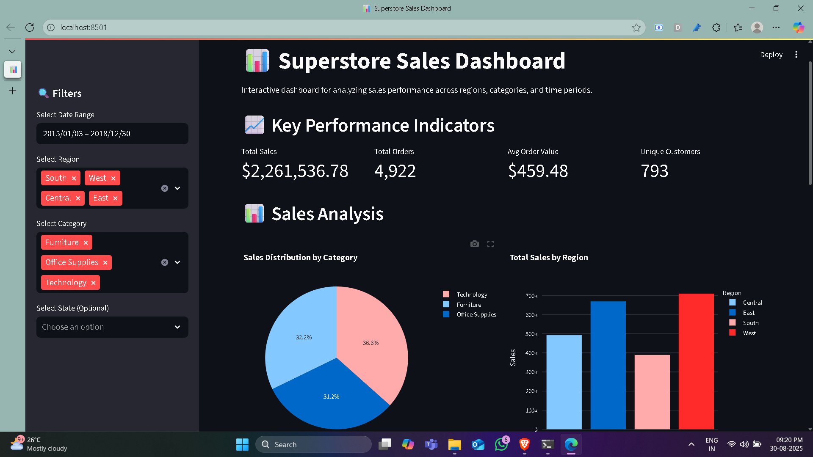

# 📊 Sale-ytics: Superstore Sales Data Analysis


A comprehensive sales data analysis project that transforms raw Superstore data into actionable business intelligence with interactive dashboards and advanced analytics.

## 🎯 Overview

Sale-ytics is an end-to-end data analysis solution that processes, analyzes, and visualizes sales data to uncover patterns, trends, and opportunities for business growth. The project includes exploratory data analysis, customer segmentation, geographical analysis, and interactive dashboards.

## 📊 Dataset

The project uses the **Superstore Sales Dataset** containing:
- **9,800+ transactions** across multiple years
- **3 product categories** (Furniture, Office Supplies, Technology)
- **4 geographical regions** (West, East, South, Central)
- **800+ unique customers** across multiple segments

## 🚀 Features

### 📈 Core Analysis
- **Sales Performance Metrics**: Total sales, profit, order analysis
- **Temporal Analysis**: Monthly trends, seasonal patterns, YoY growth
- **Geographical Analysis**: Regional performance, state-level insights
- **Product Analysis**: Category and sub-category performance
- **Customer Segmentation**: RFM analysis, customer lifetime value

### 🎨 Visualization
- **Interactive Dashboards**: Streamlit-based web application
- **Time Series Charts**: Monthly sales trends and forecasts
- **Geographical Maps**: Regional performance heatmaps
- **Comparative Analysis**: Side-by-side performance metrics
- **Customer Analytics**: Segmentation and behavior analysis

### 📋 Reports
- **Executive Summary**: Key performance indicators
- **Detailed Analysis**: Comprehensive insights by category
- **Actionable Recommendations**: Data-driven business strategies
- **Export Capabilities**: PDF, CSV, and image exports

## 🛠️ Tech Stack

### Programming Languages
- **Python 3.8+**: Core programming language

### Data Processing
- **Pandas**: Data manipulation and analysis
- **NumPy**: Numerical computations
- **Python-dateutil**: Date handling utilities

### Visualization
- **Matplotlib**: Static visualizations
- **Seaborn**: Statistical visualizations
- **Plotly**: Interactive visualizations
- **Streamlit**: Web application framework

### Utilities
- **Jupyter Notebooks**: Interactive analysis
- **Scikit-learn**: Machine learning utilities
- **TensorFlow**: Deep learning capabilities

### 💻 Dashboard View 



## 📁 Project Structure

```bash
Sale-ytics-Sales-Data-Analysis/
│
├──streamlit-deployment/
├── sales_dashboard.py          # Your main app file
├── requirements.txt            # Dependencies
│
└── Dataset/
    └── Processed/
        └── cleaned_sales_data.csv  # Your processed data
├── dataset/
│   ├── raw/
│   │   └── Data.csv
│   └── processed/
│       └── cleansd_sales_data.csv
│
└── src/
    ├── advance analysis/
    │   ├── Correlation Analysis/
    │   ├── Customer Lifetime Value Calculation/
    │   ├── Monthly sales trend/
    │   └── RFM Analysis/
    │
    ├── Exploratory Data Analysis (EDA)/
    │   ├── Customer Analysis/
    │   ├── Geographical Analysis/
    │   ├── Sales by Category and Sub-Category/
    │   ├── Shipping Analysis/
    │   ├── Time Series Analysis/
    │   └── Total Sales and Profit Summary/
    │
    └── notebooks/
        ├── data cleaning/
        ├── data loading/
        └── libraries/
